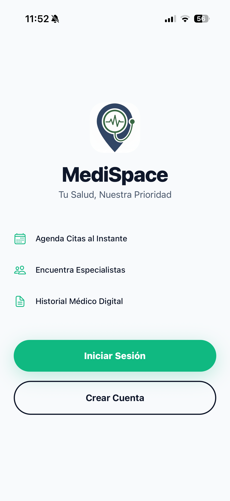
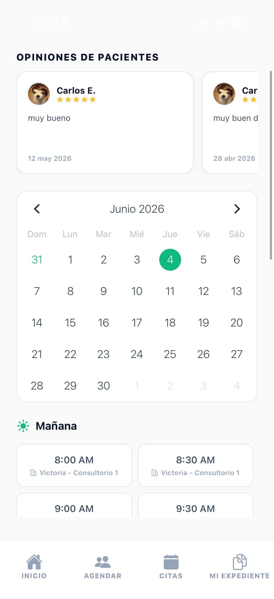
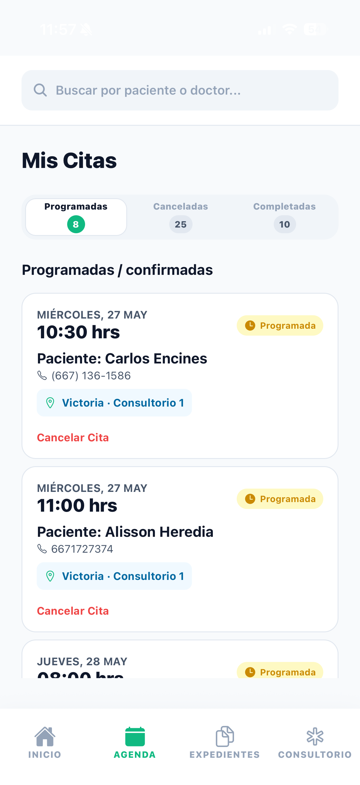
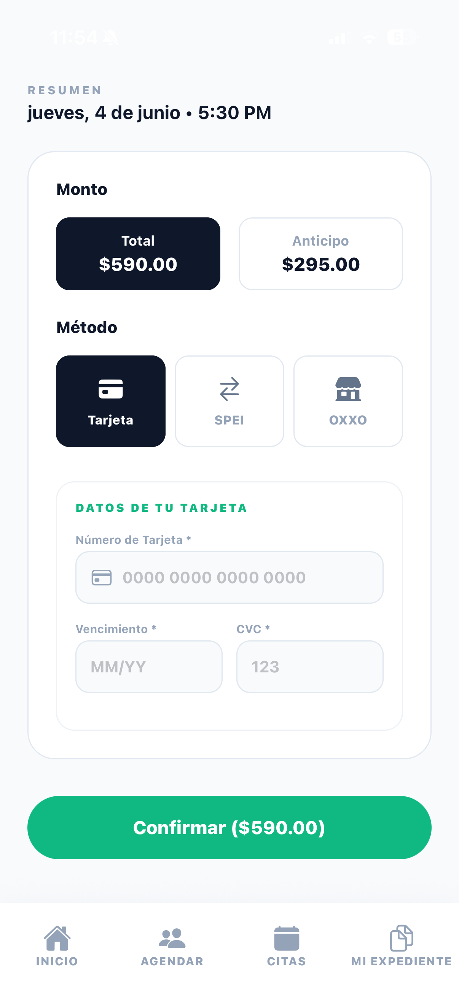

# Medispace Mobile

[](LICENSE) [](https://expo.dev)

Proyecto móvil de Medispace — aplicación para gestión de citas y registros médicos.

## Qué es la app

Medispace Mobile es una aplicación móvil para clínicas y centros de salud diseñada para facilitar la gestión diaria: permite a recepcionistas, personal administrativo, médicos y pacientes interactuar con el sistema de citas, historiales médicos y comunicaciones internas.

## Qué hace

- Gestiona agendamiento de citas: crear, editar y cancelar citas con notificaciones.
- Permite ver y actualizar el historial de pacientes y registros clínicos básicos.
- Facilita la comunicación entre pacientes y personal (notificaciones y mensajes básicos).
- Ofrece paneles de control para distintos roles (administración, médicos, recepcionistas, pacientes) con vistas adaptadas.
- Soporta subida de documentos e imágenes asociadas a pacientes y registros.
- Integra autenticación segura y manejo de sesiones a través de `supabase`.

## Capturas

Presentamos una galería con capturas reales de la aplicación.

<p align="center">
	
	
	
</p>

<p align="center">
	
	
	
</p>

## Instalación y ejecución

- Instalar dependencias:

```bash
npm install
```

- Ejecutar en Expo (desarrollo):

```bash
npm start
# o
npx expo start
```

- Abrir en Android/iOS o en simulador

## Desarrollo (scripts útiles)

- **start**: inicia Metro/Expo (modo interactivo)
- **start:lan**: `expo start --lan` (útil en red local)
- **start:tunnel**: `expo start --tunnel` (útil cuando no hay red directa)
- **web**: `expo start --web` (preview en navegador)

Ejemplo:

```bash
npm run start:lan
```

## Contribuir

Ver `CONTRIBUTING.md`.

## Licencia

Proyecto con licencia MIT. Ver `LICENSE`.
